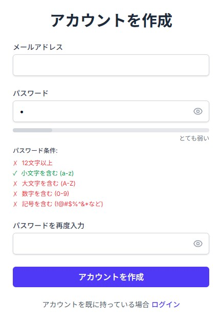
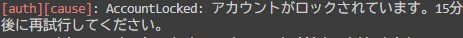
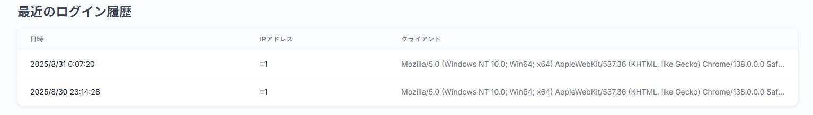

# セキュア認証ウェブアプリ

## 1. 概要

トークンベース認証を用いた認証・認可機能を備えたウェブアプリをNext.jsで実装しました。

## 2. 実装した機能一覧

以下のセキュリティ機能を実装しました。

### 基本機能

- サインアップ機能: メールアドレスとパスワードによるユーザー登録
- ログイン機能: 登録情報を用いた認証
- ログアウト機能: セッションの破棄

### 高度なセキュリティ機能

- 【ブルートフォース攻撃対策】アカウントロック機能: ログインに連続で5回失敗したアカウントを15分間ロックします。
- 【ブルートフォース攻撃対策】ログイン試行の間隔制限: 2秒以内の連続したログイン試行をブロックし、高速なパスワード試行を防止します。
- 【不正アクセス検知】ログイン履歴の表示機能: ログイン成功時の日時、IPアドレス、User-Agentを記録し、ユーザーが自身のログイン履歴を確認できるようにします。
- 【セキュアなUI/UX】高度なサインアップフォーム:
  - パスワードの入力ミスを防ぐための確認用パスワード入力欄
  - 安全なパスワード設定を促すリアルタイムのパスワード強度メーター
  - 入力内容を確認しやすくするパスワード表示/非表示トグル

## 3. 主要機能の詳細

### ① 高度なサインアップ機能

ユーザーが安全なパスワードを設定し、かつ快適に操作できるUIを実装しました。

- パスワード強度メーター: zxcvbnライブラリを使用し、パスワードの強度をリアルタイムで0〜4の5段階で評価・表示します。「安全」レベル（スコア3）以上のパスワードでなければ登録できないよう、サーバーサイドだけでなくフロントエンドでも厳格なバリデーションを行っています。
- パスワード表示トグル: 目玉アイコンをクリックすることで、パスワードの文字列をマスクされた状態と平文の状態で切り替えられます。これにより、ユーザーは複雑なパスワードを正確に入力できます。



### ② アカウントロックとログイン試行の間隔制限

総当たりでパスワードを試行するブルートフォース攻撃への対策として、2種類の機能を実装しました。

- アカウントロック: ログインに5回連続で失敗すると、該当アカウントは15分間ロックされ、正しいパスワードを入力してもログインできなくなります。これにより、攻撃者が無制限にパスワードを試すことを防ぎます。

- 間隔制限: ログインAPIへのリクエストが2秒以内に連続して行われた場合、処理を中断してエラーを返します。これにより、自動化された高速な攻撃ツールの効率を大幅に低下させます。

#### ③ ログイン履歴の表示

ユーザー自身が不正アクセスを検知できるようにするため、ログイン履歴機能は不可欠です。

- ログインが成功するたびに、その時点の日時、IPアドレス、User-Agentをデータベースに記録します。
- ログイン後のダッシュボード画面で、直近10件のログイン履歴を一覧表示します。身に覚えのないログインがないかを確認することで、アカウント乗っ取りの早期発見に繋がります。



## 4. セキュリティ設計へのこだわり

本アプリケーションでは、以下の点に配慮しました。

- パスワードのハッシュ化: ユーザーパスワードは、bcryptライブラリを用いて、ソルト付きのハッシュ値としてデータベースに保存しています。元のパスワードは一切保存しておらず、万が一データベースが漏洩してもパスワードが直接知られることはありません。
- セキュアなセッション管理: Auth.jsのデフォルト設定を活用し、セッション情報を管理するCookieにはHttpOnly, Secure, SameSite=Strictといったセキュア属性を付与しています。これにより、XSS（クロスサイトスクリプティング）によるCookieの盗難やCSRF（クロスサイトリクエストフォージェリ）攻撃のリスクを大幅に低減しています。
- ブルートフォース攻撃への多層防御: 上記で述べた「アカウントロック」と「ログイン試行の間隔制限」の2つの機能を組み合わせることで、単純なものから高度なものまで、幅広いブルートフォース攻撃に対して堅牢な防御を実現しています。
- 推測不可能なIDの採用: データベースのユーザーIDには、連番（1, 2, 3...）ではなくCUIDを採用しています。これにより、URLから他のユーザーIDを推測して情報を不正に取得しようとするIDOR（Insecure Direct Object References）脆弱性を防いでいます。

## 5. 使用技術

- フレームワーク: Next.js 14 (App Router)
- 言語: TypeScript
- 認証: Auth.js (NextAuth.js v5)
- データベース/ORM: SQLite, Prisma
- UI: Tailwind CSS
- パスワード強度計算: zxcvbn
- パスワードハッシュ化: bcrypt

## 6. セットアップ方法

リポジトリをクローンします。

```bash
git clone https://github.com/2ufkpfb9daxnik/securewebapp.git
cd securewebapp
```

依存パッケージをインストールします。

```bash
npm install
```

.env.localファイルを作成し、環境変数を設定します。最低限AUTH_SECRETが必要です。

```.env.local
AUTH_SECRET="openssl rand -base64 32" # ターミナルでこのコマンドを実行して生成した値などを設定
DATABASE_URL="file:./dev.db"
```

Prismaを使ってデータベースを生成します。

```bash
npx prisma migrate dev
```

開発サーバーを起動します。

```bash
npm run dev
```

ブラウザで [http://localhost:3000](http://localhost:3000) を開きます。
